```mermaid
sequenceDiagram
    participant User as ユーザー
    participant Frontend as フロントエンド
    participant API as APIサーバー
    participant DB as データベース

    User->>Frontend: ログイン要求
    Frontend->>API: 認証リクエスト
    API->>DB: ユーザー情報照会
    DB-->>API: ユーザー情報返却
    API-->>Frontend: 認証トークン
    Frontend-->>User: ログイン成功
```

# mermaid検証


```mermaid
classDiagram
    class User {
        +String id
        +String name
        +String email
        +Date createdAt
        +login()
        +logout()
        +updateProfile()
    }

    class Document {
        +String id
        +String title
        +String content
        +User author
        +Date createdAt
        +save()
        +delete()
        +share()
    }

    class Comment {
        +String id
        +String content
        +User author
        +Date createdAt
        +edit()
        +delete()
    }

    User ||--o{ Document : "creates"
    Document ||--o{ Comment : "has"
    User ||--o{ Comment : "writes"
```




```mermaid
gitgraph
    commit id: "Initial commit"
    branch develop
    checkout develop
    commit id: "Add user authentication"
    commit id: "Implement document CRUD"
    branch feature/ai-integration
    checkout feature/ai-integration
    commit id: "Add AI service integration"
    commit id: "Implement auto-summarization"
    checkout develop
    merge feature/ai-integration
    commit id: "Fix merge conflicts"
    checkout main
    merge develop
    commit id: "Release v1.0.0"
    tag: "v1.0.0"
```


