# uml

## PlantUML 記法検証用サンプル

このドキュメントは、各ドキュメント管理ツールの PlantUML 記法対応状況を検証するためのサンプル図表集です。

### 1. クラス図（Class Diagram）

#### 1.1 基本的なクラス図

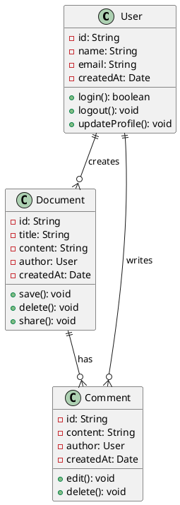

#### 1.2 継承関係を含むクラス図

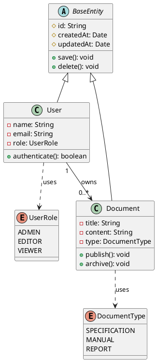

### 2. シーケンス図（Sequence Diagram）

#### 2.1 基本的なシーケンス図

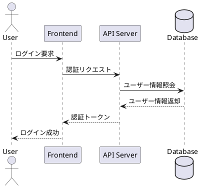

#### 2.2 複雑なシーケンス図

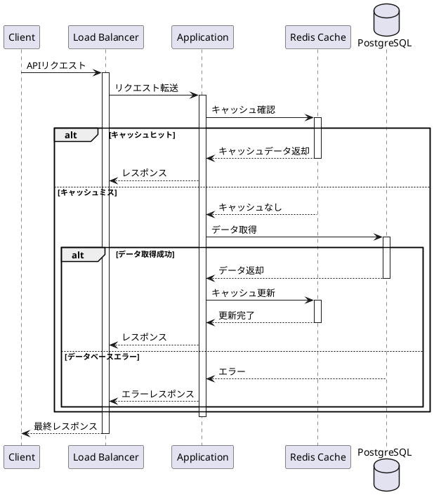

### 3. アクティビティ図（Activity Diagram）

#### 3.1 基本的なアクティビティ図

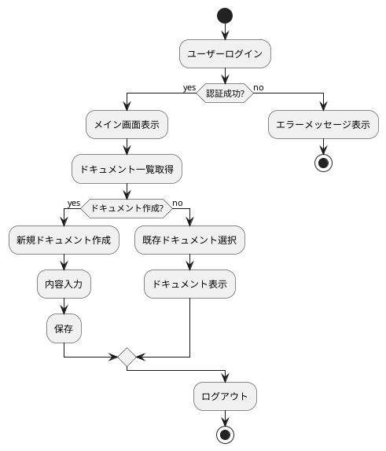

#### 3.2 複雑なワークフロー

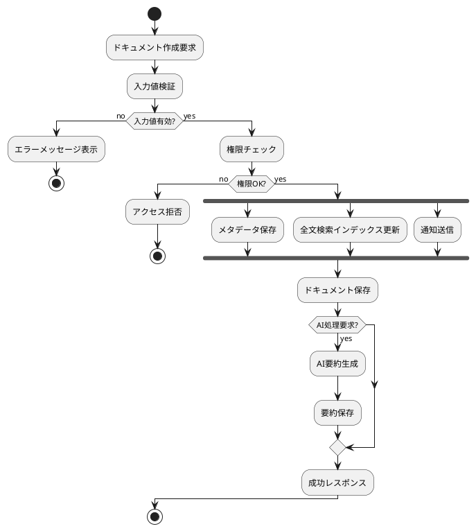

### 4. ユースケース図（Use Case Diagram）

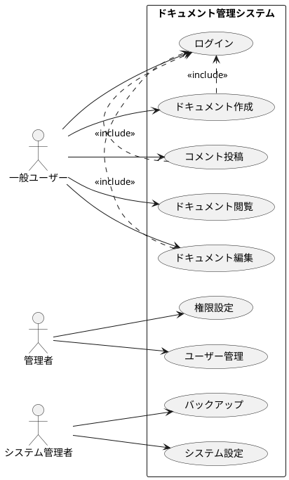

### 5. コンポーネント図（Component Diagram）

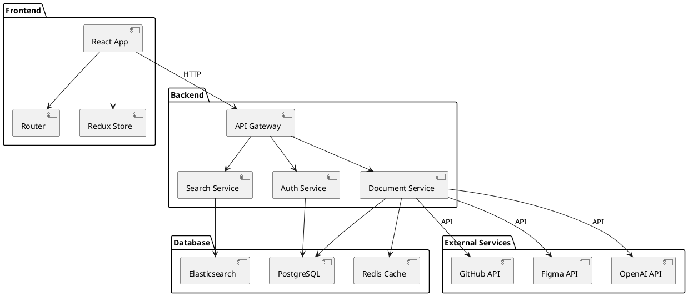

### 6. 配置図（Deployment Diagram）

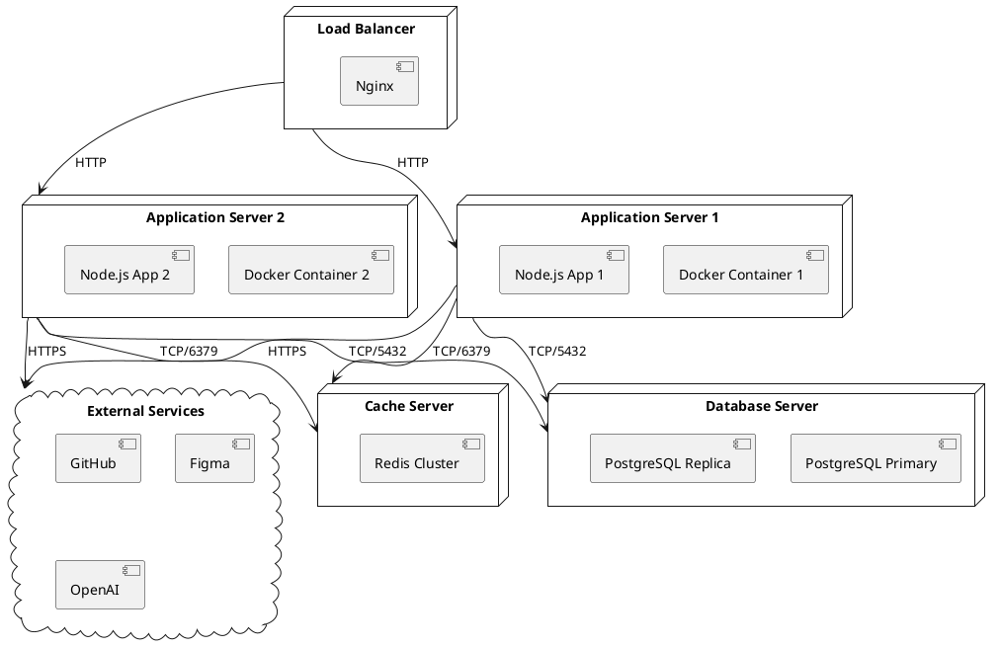

### 7. 状態図（State Diagram）

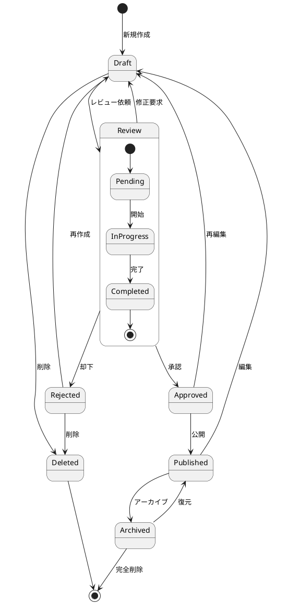

### 8. タイミング図（Timing Diagram）

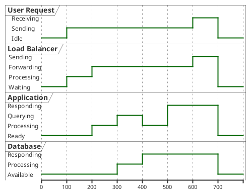

### 9. オブジェクト図（Object Diagram）

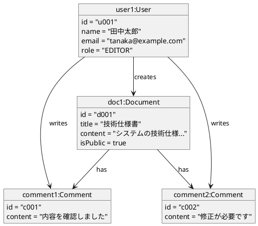

### 10. ネットワーク図

```plantuml
@startuml
!define AWSPUML https://raw.githubusercontent.com/awslabs/aws-icons-for-plantuml/v14.0/dist
!includeurl AWSPUML/AWSCommon.puml
!includeurl AWSPUML/ApplicationIntegration/ApplicationLoadBalancer.puml
!includeurl AWSPUML/Compute/EC2.puml
!includeurl AWSPUML/Database/RDS.puml
!includeurl AWSPUML/Database/ElastiCache.puml

ApplicationLoadBalancer(alb, "Application Load Balancer", "")
EC2(ec2_1, "Web Server 1", "")
EC2(ec2_2, "Web Server 2", "")
RDS(rds, "PostgreSQL Database", "")
ElastiCache(cache, "Redis Cache", "")

alb --> ec2_1
alb --> ec2_2
ec2_1 --> rds
ec2_2 --> rds
ec2_1 --> cache
ec2_2 --> cache
@enduml
```

### 11. 検証チェックリスト

各ツールで以下の項目を確認してください：

#### レンダリング確認

* [ ] クラス図が正しく表示される
* [ ] シーケンス図が正しく表示される
* [ ] アクティビティ図が正しく表示される
* [ ] ユースケース図が正しく表示される
* [ ] コンポーネント図が正しく表示される
* [ ] 配置図が正しく表示される
* [ ] 状態図が正しく表示される
* [ ] タイミング図が正しく表示される
* [ ] オブジェクト図が正しく表示される
* [ ] ネットワーク図が正しく表示される

#### 編集機能確認

* [ ] PlantUML 記法でリアルタイム編集可能
* [ ] 図表のエクスポートが可能（PNG/SVG 等）
* [ ] 図表のズーム・パン操作が可能
* [ ] スタイリング・テーマ変更が可能

#### 高度な機能確認

* [ ] includeurl による外部ライブラリ読み込み
* [ ] define による定数定義
* [ ] 条件分岐（alt/else）の表示
* [ ] ループ（loop）の表示
* [ ] ノート・コメントの表示

#### パフォーマンス確認

* [ ] 複雑な図表でも適切な表示速度
* [ ] 大量の要素を含む図表の描画性能
* [ ] 図表生成・更新時のレスポンス

#### AI 連携確認

* [ ] AI が PlantUML 記法を理解・解釈可能
* [ ] AI による PlantUML 図表の自動生成
* [ ] 図表の説明文自動生成

***

**使用方法**: 各ツールでこのファイル全体をコピー＆ペーストし、上記の図表が正しく表示されるかを確認してください。PlantUML に対応していないツールの場合は、代替手段（プラグイン、外部サービス連携等）があるかも合わせて調査してください。
